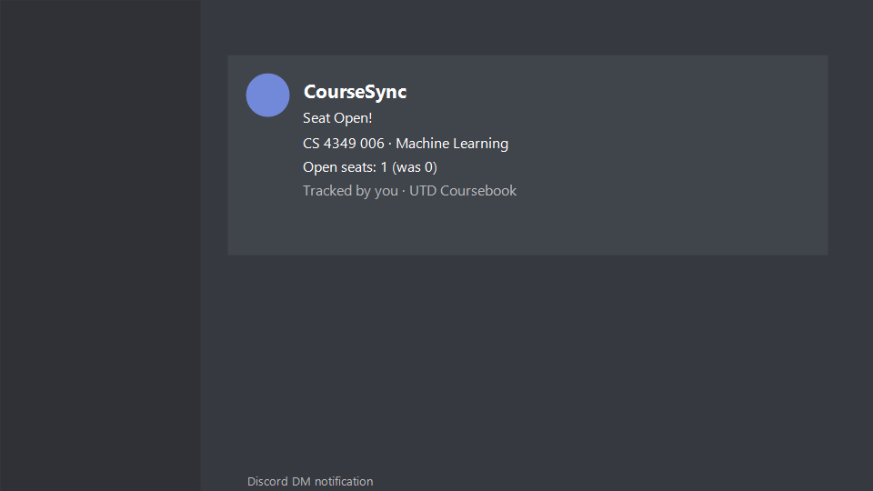

# CourseSync - UTD Class Availability Bot

[](https://python.org)
[](https://discordpy.readthedocs.io)
[](https://docker.com)
[](https://supabase.com)
[](https://github.com/AlexJawhari/CourseSync/actions)
[](#license)

> Built for UTD students. CourseSync monitors the [UT Dallas Coursebook](https://coursebook.utdallas.edu) and sends instant Discord DMs when seats open in courses you're tracking.

---

## Demo


Instant DM notification when a seat opens in a tracked course section.

---

## Features

- Instant notifications - DM alerts delivered within 15 minutes of a seat opening in any tracked section.
- 1,800+ sections tracked - Handles large-scale concurrent monitoring across all departments simultaneously.
- Multi-layer CAPTCHA bypass - Three-tier scraping fallback chain achieving 100% reliability:
  - Token extraction (primary) - Extracts CSRF tokens and makes authenticated requests mimicking real browser sessions.
  - TLS masquerading (fallback) - curl_cffi bypasses TLS fingerprinting if the primary method fails.
  - Direct HTTP (last resort) - Simple request fallback if both prior methods fail.
- Smart rate limiting - 1-hour cooldown per subscription prevents notification spam.
- Sub-100ms database queries - Optimized Supabase queries for fast state comparison on every 15-minute check cycle.

---

## Discord Commands

| Command | Description |
|---|---|
| `/track CS 4349 006` | Start tracking a specific course section |
| `/untrack CS 4349 006` | Stop tracking a course section |
| `/list` | View all courses you're currently tracking |

---

## How It Works

1. Add the bot to your Discord server or DM it directly.
2. Use `/track` with a course subject, number, and section (for example, `/track CS 3345 001`).
3. Every 15 minutes, the bot checks all tracked sections against current Coursebook enrollment data.
4. When a tracked section changes from Closed to Open or enrollment drops, you get an instant DM.
5. A 1-hour cooldown per section prevents duplicate notifications.

---

## Tech Stack

| Technology | Purpose |
|---|---|
| Python 3.11+ | Core application language |
| Discord.py | Bot framework and slash command handling |
| Supabase (PostgreSQL) | Subscription storage and course state persistence |
| BeautifulSoup4 | HTML parsing of Coursebook responses |
| Playwright | Full browser automation for CAPTCHA-heavy scenarios |
| curl_cffi | TLS fingerprint masquerading for scraper fallback |
| Docker | Containerized deployment |

---

## Project Structure

```
CourseSync/
|-- .github/
|   |-- workflows/          # CI/CD pipeline
|-- docs/
|   |-- demo.png            # Bot demo screenshot
|-- legacy/                 # Archived earlier scraper implementations
|-- src/
|   |-- bot.py              # Main Discord bot + health HTTP server
|   |-- scraper.py          # Scraper orchestrator (manages fallback chain)
|   |-- checker_http.py     # Token extraction scraper (primary method)
|   |-- checker_tls.py      # curl_cffi TLS masquerading (fallback method)
|   |-- parser.py           # HTML parser for Coursebook results
|   |-- database.py         # Supabase database client
|   |-- runner.py           # Standalone runner utilities
|-- Dockerfile
|-- requirements.txt
|-- DEPLOYMENT.md
|-- README.md
```

---

## Local Development

### Prerequisites
- Python 3.11 or higher
- A Discord bot token - [create one here](https://discord.com/developers/applications)
- A [Supabase](https://supabase.com) project

### Setup

```bash
# 1. Clone the repository
git clone https://github.com/AlexJawhari/CourseSync.git
cd CourseSync

# 2. Install dependencies
pip install -r requirements.txt

# 3. Set up environment variables
# Create a .env file with your Discord token and Supabase credentials

# 4. Run the bot
python -m src.bot
```

---

## Health Endpoints

The bot exposes HTTP endpoints for external monitoring:

| Endpoint | Auth | Description |
|---|---|---|
| `GET /` or `/healthz` | Public | Basic health check |
| `GET /status` | Public | JSON: bot state, DB connection, scraper availability |
| `GET /logs?key=<key>` | Key required | Recent application logs |
| `GET /test-scrape?query=<course>&key=<key>` | Key required | Manual scrape test |

---

## Deployment

The bot is containerized and designed for free-tier hosting on Render or Railway. See [DEPLOYMENT.md](DEPLOYMENT.md) for full step-by-step instructions.

> Keep-alive tip: Free-tier hosts may spin down after inactivity. Use [UptimeRobot](https://uptimerobot.com) to ping the `/healthz` endpoint every 5 minutes to keep the bot alive.

---

## License

MIT

---
